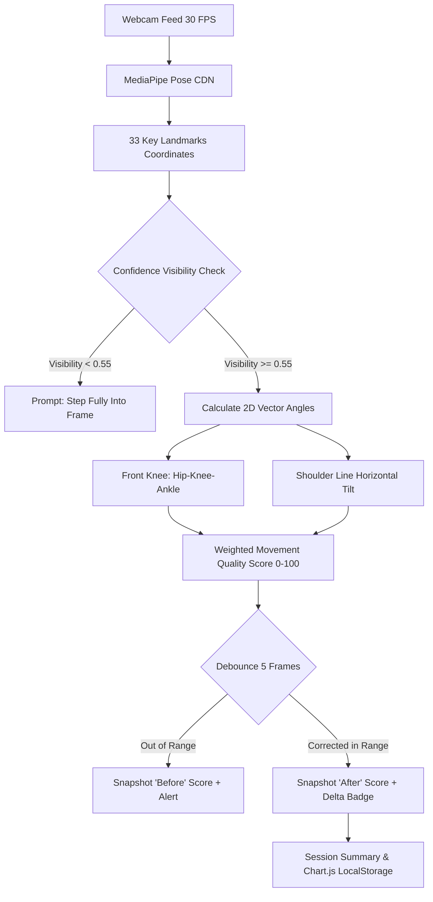

# Adaptive Yoga Coach — AI-Powered Personalized Yoga & Wellness Companion

> **Hackathon:** HRA Groups Solo Innovator 2026  
> **Author:** Solo Innovator Track  
> **Pose Analyzed:** Warrior II (*Virabhadrasana II*)  

---

## 🌟 Overview

**Adaptive Yoga Coach** is an edge-native, real-time posture coaching companion designed to democratize high-quality yoga alignment feedback. 

Unlike conventional fitness apps that stream pre-recorded videos without feedback or transmit private webcam video to cloud servers, Adaptive Yoga Coach runs **100% locally in the browser**. It detects geometric alignment deviations in real time using MediaPipe Pose, calculates a normalized movement quality score (0–100), offers debounced micro-coaching adjustments, captures real measured before/after improvement deltas, and visualizes longitudinal practice progress over time.

---

## 📐 Posture Criteria & Angle Specifications

| Metric | Target Optimal | Acceptable Range | Feedback Threshold |
| :--- | :---: | :---: | :--- |
| **Front Knee Angle** | `90°` | `85° – 105°` | Outside `82° – 108°` triggers debounced knee stack reminder |
| **Rear Leg Angle** | `180°` | `150° – 180°` | `< 130°` indicates non-Warrior II stance |
| **Shoulder Tilt** | `0°` | `< 8°` | `> 10°` triggers torso upright leveling prompt |
| **Landmark Confidence** | `> 0.70` | `> 0.55` | `< 0.55` triggers "Step fully into frame" gating |



---

## ⚡ Key Features

1. **Personalized Onboarding & Dynamic Session Recommendation**:
   - Captures user goals (Flexibility, Strength, Stress Relief, Balance) and experience levels (Beginner, Intermediate, Advanced).
   - Generates contextual "Why This Session" guidance tailored to the practitioner's background.

2. **Edge Pose Detection & Geometric Angle Analysis (MediaPipe Pose)**:
   - Tracks 33 body landmarks entirely client-side via CDN scripts.
   - Calculates 2D vector angles for the **front bent knee** (Hip $\to$ Knee $\to$ Ankle) and **horizontal shoulder line alignment**.
   - Auto-detects front vs. rear leg orientation and stance classification.

3. **Live Movement Quality Score (0–100)**:
   - Evaluates deviation from optimal alignment (front knee ~90°, horizontal shoulders).
   - Dynamically updates a live score and visual alignment quality grade.

4. **Debounced Alignment Feedback & Confidence Gating**:
   - Employs temporal multi-frame debouncing to eliminate flickering feedback.
   - Prompts `"Try keeping your front knee aligned with your ankle"` when alignment drifts.
   - Displays `"Good alignment! Keep holding steady"` when in optimal range.
   - Implements confidence gating: prompts `"Step fully into the camera frame"` if key landmarks have low visibility instead of generating inaccurate scores.

5. **Real Measured Before / After Score & Improvement Delta**:
   - Records the practitioner's baseline score the instant alignment feedback triggers.
   - Captures the corrected score upon successful posture adjustment.
   - Computes the real measured improvement ($\Delta = \text{After} - \text{Before}$) and presents live feedback badges.

6. **Longitudinal Progress Tracking (Chart.js & LocalStorage)**:
   - Stores session records locally in `localStorage`.
   - Renders historical movement quality progression across sessions using Chart.js.
   - Dynamically computes plain-language progress insights comparing earlier and recent practice data.

7. **Responsible & Privacy-First Design**:
   - **Zero Video Transmission**: Webcam frames never leave the client device.
   - Clear wellness and non-diagnostic disclaimers.

---

## 🛠️ Tech Stack

- **Frontend**: Plain HTML5, Modern Vanilla CSS3, Vanilla JavaScript (ES6+).
- **Computer Vision**: Google MediaPipe Pose, Camera Utils, Drawing Utils (via CDN).
- **Data Visualization**: Chart.js (via CDN).
- **Persistence**: Browser `localStorage` (Zero external database or server requirement).

---

## 🚀 Getting Started

### Local Quickstart
Because browser webcam access (`getUserMedia`) requires a secure context (`http://localhost`), launch any simple local static file server:

```bash
# Using Python 3
python -m http.server 3000
```

Open your browser and navigate to:
```
http://localhost:3000
```

## 🧪 Hackathon Judge Verification Runbook

To test and verify the complete MVP end-to-end:

1. **Launch App**: Open `http://localhost:3000` (or your static host).
2. **Onboarding Screen**:
   - Enter your name (e.g. `Maya`), select your goal and experience level (`Beginner`).
   - Click **"Continue to Today's Session"**.
3. **Session Screen**:
   - Observe the dynamic `"Why This Session For You"` card explaining beginner alignment.
   - Click **"Start Camera & Practice"**.
4. **Live Pose Tracking**:
   - Allow camera permissions.
   - Stand back until your body is in the frame.
   - Observe the live neon skeleton tracking your joints smoothly at ~30 FPS.
5. **Warrior II Stance Detection**:
   - Step into Warrior II (bend front knee, extend arms horizontally).
   - Observe the **Front Knee Angle** and **Shoulder Tilt** updating dynamically in the HUD and directly on the canvas near your front knee.
6. **Alignment Feedback & Debounce**:
   - Straighten your front knee slightly ($>110°$): Observe the debounced amber warning: *"Try keeping your front knee aligned with your ankle"*. Notice your baseline score is captured.
   - Correct your knee bend back to ~90°: Observe the green confirmation: *"Good alignment! Keep holding steady"* and the dynamic badge: *"Movement quality improved by +X pts"*.
7. **Session Summary**:
   - Click **"End Session & View Summary"** (or press `ESC`).
   - Review your measured **Initial Score**, **Corrected Score**, and **Improvement Delta**.
8. **Progress Analytics**:
   - Click **"View Progress History & Chart"**.
   - Review the Chart.js line graph and plain-language insight derived from your actual stored sessions.

---

## 🔒 Privacy & Wellness Disclaimer

- **Privacy**: Camera access is used solely for client-side live pose tracking. Video is not recorded, stored, or sent anywhere.
- **Wellness Notice**: This application is a wellness and fitness companion, not a medical diagnostic or physical therapy tool.
