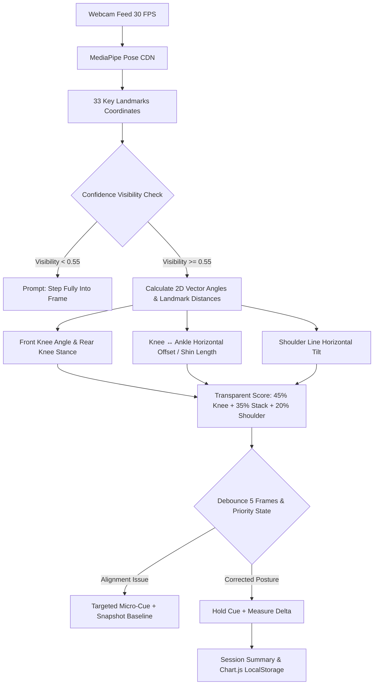

# Adaptive Yoga Coach — AI-Powered Personalized Yoga & Wellness Companion

> **Hackathon:** HRA Groups Solo Innovator 2026  
> **Author:** Motipalli Tej Raghuveer (Solo Innovator Track)  
> **Pose Analyzed:** Warrior II (*Virabhadrasana II*)  
> **Live Web App:** [https://adaptiveyoga.netlify.app/](https://adaptiveyoga.netlify.app/)  
> **Repository:** [https://github.com/HRAGROUPS/Solo-Innovator](https://github.com/HRAGROUPS/Solo-Innovator)  

---

## 🌟 Overview

**Adaptive Yoga Coach** is an edge-native, real-time posture coaching companion designed to democratize high-quality yoga alignment feedback. 

Unlike conventional fitness apps that stream pre-recorded videos without feedback or transmit private webcam video to cloud servers, Adaptive Yoga Coach runs **100% locally in the browser**. It detects geometric alignment deviations in real time using MediaPipe Pose, calculates a normalized movement quality score (0–100), offers debounced micro-coaching adjustments, captures real measured before/after improvement deltas, and visualizes longitudinal practice progress over time.

---

## 📐 Posture Criteria & Angle Specifications

| Metric | Target Optimal | Acceptable Range | Feedback Threshold |
| :--- | :---: | :---: | :--- |
| **Front Knee Angle** | `90°` | `85° – 105°` | Outside `82° – 105°` triggers debounced knee depth adjustment |
| **Knee ↔ Ankle Stack** | `≤ 12%` | `0% – 12%` | `> 12%` offset triggers "Bring your front knee back over your ankle" |
| **Rear Leg Angle** | `180°` | `150° – 180°` | `< 130°` indicates non-Warrior II stance |
| **Shoulder Tilt** | `0°` | `< 8°` | `> 8°` triggers torso upright leveling prompt |
| **Landmark Confidence** | `> 0.70` | `> 0.55` | `< 0.55` triggers "Step fully into frame" gating |



---

## ⚡ Key Features

1. **Personalized Onboarding & Dynamic Session Recommendation**:
   - Captures user goals (Flexibility, Strength, Stress Relief, Balance) and experience levels (Beginner, Intermediate, Advanced).
   - Generates contextual "Why This Session" guidance tailored to the practitioner's background.

2. **Edge Pose Detection & 2D Landmark Geometry (MediaPipe Pose)**:
   - Tracks 33 body landmarks entirely client-side via CDN scripts.
   - Calculates 2D vector angles for the **front bent knee** and **rear leg extension**.
   - Computes **Knee ↔ Ankle camera-plane spatial alignment** (horizontal displacement relative to visible shin length).
   - Auto-detects front vs. rear leg orientation and classifies Warrior II stance.

3. **Live Transparent Movement Quality Score (0–100)**:
   - Evaluates:
     - **45%**: Knee angle control (deviation from 90°).
     - **35%**: Knee ↔ ankle spatial stack (target $\le 12\%$ shin-normalized offset).
     - **20%**: Horizontal shoulder levelness (target $< 8^\circ$).
   - Displays live score, quality grade, and real-time metric readings in the HUD.

4. **Debounced Alignment Feedback & Confidence Gating**:
   - Employs temporal multi-frame debouncing to eliminate flickering feedback.
   - Prompts `"Try keeping your front knee aligned with your ankle"` when alignment drifts.
   - Displays `"Good alignment! Keep holding steady"` when in optimal range.
   - Implements confidence gating: prompts `"Step fully into the camera frame"` if key landmarks have low visibility instead of generating inaccurate scores.

5. **Real Measured Before / After Score & Improvement Delta**:
   - Records the practitioner's baseline score the instant alignment feedback triggers.
   - Captures the corrected score upon successful posture adjustment.
   - Computes the real measured improvement ($\Delta = \text{After} - \text{Before}$) and presents live feedback badges.

6. **Longitudinal Progress Tracking (Chart.js & LocalStorage)**:
   - Stores session records locally in `localStorage`.
   - Renders historical movement quality progression across sessions using Chart.js.
   - Dynamically computes plain-language progress insights comparing earlier and recent practice data.

7. **Responsible & Privacy-First Design**:
   - **Zero Video Transmission**: Webcam frames never leave the client device.
   - Clear wellness and non-diagnostic disclaimers.

---

## 🛠️ Tech Stack

- **Frontend**: Plain HTML5, Modern Vanilla CSS3, Vanilla JavaScript (ES6+).
- **Computer Vision**: Google MediaPipe Pose, Camera Utils, Drawing Utils (via CDN).
- **Data Visualization**: Chart.js (via CDN).
- **Persistence**: Browser `localStorage` (Zero external database or server requirement).

---

## 🚀 Getting Started

### Local Quickstart
Because browser webcam access (`getUserMedia`) requires a secure context (`http://localhost`), launch any simple local static file server:

```bash
# Using Python 3
python -m http.server 3000
```

Open your browser and navigate to:
```
http://localhost:3000
```

### Automated Verification Suite
To run the automated test suite verifying all 15 core Upgrade 3 scenarios:
```bash
node test_upgrade3.js
```

---

## 🌟 Upgrade 3: Intelligent AI Coach & Movement Intelligence

Upgrade 3 elevates the companion from a posture detector to an **interpreting, explaining, and adapting AI Coach**:

1. **Structured AI Coach Layer (`generateCoachMessage`)**:
   - Interprets deterministic CV measurements without recalculating geometry.
   - 4 Situational Intelligence Levels:
     - **Level 1 (Immediate)**: Concise cue targeting the primary physical action.
     - **Level 2 (Explanatory)**: Adds contextual explanation of joint drift.
     - **Level 3 (Personalized)**: Connects hold quality to practitioner goals (Balance, Flexibility, Strength, Stress).
     - **Level 4 (Historical)**: References multi-session continuity and recurring strengths/weaknesses.

2. **Coaching Priority Engine**:
   - Delivers strictly **one actionable cue** at a time based on a 6-tier hierarchy:
     1. Camera visibility / confidence gating
     2. Knee/ankle stack deviation ($>12\%$)
     3. Knee angle depth deviation ($<82^\circ$ or $>105^\circ$)
     4. Shoulder line tilt ($>8^\circ$)
     5. Temporal hold instability / sway
     6. Optimal hold reinforcement

3. **Unified Voice & Visual Coach**:
   - Single unified decision pipeline for visual feedback banner and Web Speech API synthesis.
   - Paced rate limiting (minimum 3.5s spacing) and milestone-based announcements (1st valid pose, 5s hold, 15s hold, positive correction delta).

4. **Explainable AI & Before → After Coaching Story**:
   - **Real-Time Score Breakdown**: Live HUD display for Knee Angle (45%), Knee Stack (35%), and Shoulder Line (20%).
   - **Before → After Story**: Explains metric attribution (e.g., knee alignment $61 \to 84, +23\text{ pts}$) and next-session adaptation reasoning (**Observe → Learn → Adapt**).
   - **Practice Fingerprint Explainability**: "What This Means" card detailing Alignment, Stability, Control, and Consistency.

5. **Developer Telemetry HUD**:
   - Hidden by default, toggleable via `Ctrl+Shift+D`, `?debug=true`, or the navbar tool button.
   - Real-time inspector displaying pose, confidence, joint angles, score states, coaching level, and adaptive plan parameters.

---

## 🧪 Hackathon Judge Verification Runbook

To test and verify the complete companion end-to-end:

1. **Launch App**: Open the live application directly at **[https://adaptiveyoga.netlify.app/](https://adaptiveyoga.netlify.app/)** (or run locally at `http://localhost:3000` / run automated tests via `node test_upgrade3.js`).
2. **Onboarding Screen**:
   - Enter your name (e.g. `Maya`), select your goal and experience level (`Beginner`).
   - Click **"Continue to Today's Session"**.
3. **Session Screen**:
   - Observe the dynamic `"Why This Session For You"` card explaining beginner alignment and adaptive rationale.
   - Click **"Start Camera & Practice"**.
4. **Live Pose Tracking**:
   - Allow camera permissions.
   - Stand back until your body is in the frame.
   - Observe the live neon skeleton tracking your joints smoothly at ~30 FPS.
5. **Warrior II Stance Detection**:
   - Step into Warrior II (bend front knee, extend arms horizontally).
   - Observe the **Front Knee Angle**, **Knee Stack %**, **Shoulder Tilt**, and **Score Breakdown** updating dynamically.
6. **Alignment Feedback & Debounce**:
   - Straighten front knee slightly ($>105°$) or drift knee outward ($>12\%$): Observe the debounced warning with coach intelligence level and phase.
   - Correct posture back: Observe the green confirmation, voice coach confirmation, and measured delta badge: *"Movement quality improved by +X pts"*.
7. **Session Summary**:
   - Click **"End Session & View Summary"** (or press `ESC`).
   - Review your **Before → After Coaching Story**, measured delta, coach attribution insight, and next-session reasoning.
8. **Progress Analytics**:
   - Click **"View Progress History & Chart"**.
   - Review your **Personal Practice Fingerprint**, the **"What This Means"** explanation card, and Chart.js multi-dimensional tracking.
9. **Developer Telemetry**:
   - Press `Ctrl+Shift+D` or click the navbar tool icon to open the **Real-Time Movement Engine Inspector**.

---

## 🔒 Privacy & Wellness Disclaimer

- **Privacy**: Camera access is used solely for client-side live pose tracking. Video is not recorded, stored, or sent to external servers.
- **Wellness Notice**: This application is a wellness and fitness companion, not a medical diagnostic or physical therapy tool.

