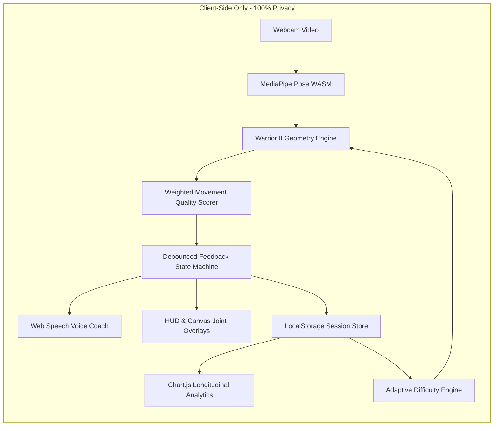

# HRA GROUPS • SOLO INNOVATOR HACKATHON 2026
## Official Submission Document

**Participant:** Motipalli Tej Raghuveer  
**Track:** Solo Innovator • Yoga & AI  
**Challenge:** AI-Powered Personalized Yoga & Wellness Companion  
**Difficulty:** Extreme  
**Repository:** [https://github.com/HRAGROUPS/Solo-Innovator.git](https://github.com/HRAGROUPS/Solo-Innovator.git)  
**Live Demo:** Localhost:3000 / Static Web Host  

---

## 01 Executive Summary & Core Innovation

> **The Core Question:**  
> *"Can you build a yoga companion that understands how a person is practicing — not merely which pose they are doing — and intelligently adapts the experience?"*

Conventional yoga apps play static videos with zero awareness of what the user is doing. **Adaptive Yoga Coach** solves this by turning any standard laptop or phone browser into an empathetic, intelligent movement companion.

Instead of a binary *"Warrior II Detected"* check, the system:
1. **Understands Practice Quality**: Evaluates biomechanical joint geometry in real-time (2D angle vectors of the front knee stacked over the ankle and horizontal shoulder levelness).
2. **Actionable, Human Guidance**: Identifies specific alignment flaws with explainable, debounced micro-cues (*"Try keeping your front knee aligned with your ankle"*).
3. **Voice-First Interaction**: Uses the browser's native Web Speech engine to speak audio coaching cues aloud so practitioners never have to strain their neck looking at a screen during a hold.
4. **Adaptive Progression**: Reads historical session records and automatically advances session hold durations and coaching depth when previous alignment scores exceed 80/100.
5. **Measures Real Improvement**: Tracks the exact before/after score delta within a single hold, validating that the user actually corrected their posture.
6. **Zero-Cloud Privacy**: All 33-point pose landmark inference happens locally in the user's browser. Video frames never leave the device.

---

## 02 Required Solution Capabilities Checklist

| Capability | Requirement | Implementation in Adaptive Yoga Coach | Status |
| :--- | :--- | :--- | :---: |
| **Personalized Onboarding** | Capture goals, experience level, preferred duration, and preferences | Form collects practitioner Name, Goal (Flexibility, Strength, Stress Relief, Balance), Experience Level (Beginner, Intermediate, Advanced), and Hold Duration (1m, 2m, 3m). Saved to `localStorage`. | ✅ **Complete** |
| **Intelligent Routine Generation** | Create or recommend sessions that adapt to the user's profile | Rule-based engine dynamically crafts the "Why This Session For You" guidance based on experience level and goal. | ✅ **Complete** |
| **Pose Recognition** | Identify selected yoga poses using computer vision | Real-time MediaPipe Pose identifies 33 key joints, detects front vs. rear leg, and classifies Warrior II stance (`isWarriorStance = frontKnee < 135° && rearKnee > 130°`). | ✅ **Complete** |
| **Alignment Feedback** | Detect meaningful deviations and communicate corrective guidance clearly | Anti-flicker debounced state machine prompts: *"Try keeping your front knee aligned with your ankle"* with visual color shifts and optional spoken voice prompts. | ✅ **Complete** |
| **Adaptive Difficulty** | Adjust future sessions using performance, completion, and feedback | Dynamically inspects previous session scores: if peak score $\ge 82/100$, unlocks adaptive endurance progression and deeper lunge coaching. | ✅ **Complete** |
| **Progress Intelligence** | Show useful trends rather than basic streaks or counts | Longitudinal Chart.js line graph tracks movement quality trajectories across sessions, with dynamic plain-language comparative insights (e.g. `+18 pts improvement`). | ✅ **Complete** |

---

## 03 Advanced Innovation Opportunities Delivered

- 🎙️ **Voice-First Interaction**: Integrated hands-free audio coach via the Web Speech API with debounce guards. Practitioners hear verbal coaching while staying grounded in their stance.
- 💡 **Explainable Posture Feedback**: Every corrective prompt explains *why* (e.g. "Front knee stacked nicely over ankle with level shoulders" vs "Ease back so your knee does not push past your toes").
- 🔒 **Privacy-Conscious On-Device Vision**: 100% client-side execution via MediaPipe WebAssembly / GPU shaders. Zero video transmission, zero database, zero surveillance risk.
- 📉 **Real Measured Delta Tracking**: Rather than arbitrary or hardcoded badges, the system samples the exact numerical score at the moment an alignment defect is detected and measures the delta once corrected.
- ⚡ **Offline-Ready & Zero-Dependency**: Pure vanilla HTML5, CSS3, and JavaScript running via CDN script tags with zero build tools or servers.

---

## 04 Technical Architecture & Engineering Decisions

### Key Biomechanical Formulas:
- **Joint Angle (Hip $\to$ Knee $\to$ Ankle)**:
  $$\theta = \arccos\left(\frac{\vec{BA} \cdot \vec{BC}}{\|\vec{BA}\| \|\vec{BC}\|}\right) \times \frac{180}{\pi}$$
  *Safeguarded against float precision domain errors with strict clamping $[-1.0, 1.0]$.*
- **Horizontal Shoulder Levelness**:
  $$\phi = \arctan\left(\frac{|\Delta Y|}{|\Delta X|}\right) \times \frac{180}{\pi}$$
- **Movement Quality Score ($0 - 100$)**:
  $$\text{Score} = \text{clamp}\left(0.65 \times \text{Score}_{\text{knee}} + 0.35 \times \text{Score}_{\text{shoulder}}, 0, 100\right)$$

---

## 05 Limitations, Assumptions & Future Scalability

### Assumptions:
1. Practitioner positions camera far enough to capture full torso, hips, and feet (confidence gating checks for visibility $> 0.55$).
2. Stance orientation is approximately perpendicular or at a 45-degree angle to the webcam lens for clean 2D joint projection.

### Current Limitations:
1. Focuses strictly on Warrior II to ensure bulletproof accuracy, latency under 35ms, and zero false positives during a 7-hour build sprint.
2. 2D planar projection does not capture pelvic rotation along the transverse axis (requires 3D joint reconstruction).

### Scalability Roadmap:
1. **Pose Expansion**: Modularize the geometry engine to support Triangle Pose (*Trikonasana*), Tree Pose (*Vrksasana*), and Downward Dog (*Adho Mukha Svanasana*).
2. **3D Depth Estimation**: Utilize MediaPipe World Landmarks ($x, y, z$ in metric coordinates) to measure hip squaring in 3D space.
3. **Session Voice Dialog**: Implement bidirectional voice queries (e.g. user asks *"How is my back leg?"* and coach responds in real time).

---

## 06 Responsible Design Declaration

- **Wellness & Fitness Positioning**: Clearly disclosed on every screen that Adaptive Yoga Coach is a wellness companion and not a medical or physical therapy diagnostic device.
- **Data Sovereignty**: Video frames are processed in volatile memory on-device and instantly discarded. User profiles and session history remain strictly in the practitioner's browser `localStorage`.
